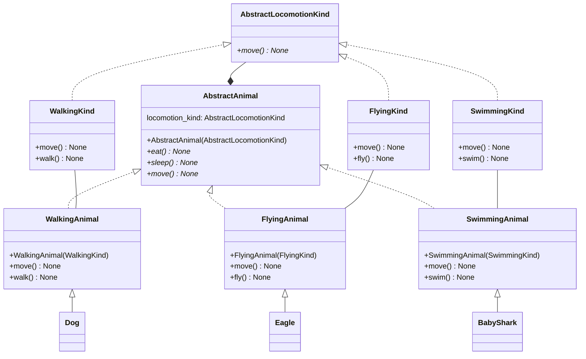

# Teste Mermaid Render

Basic project to test builtin github Mermaid Render inside markdown docs

---

## Project Architecture

```mermaid
classDiagram
    direction BT
    class AbstractLocomotionKind {
        +move()* None
    }
    class WalkingKind {
        +move() None
        +walk() None
    }
    class FlyingKind {
        +move() None
        +fly() None
    }
    class SwimmingKind {
        +move() None
        +swim() None
    }

    WalkingKind ..|> AbstractLocomotionKind
    FlyingKind ..|> AbstractLocomotionKind
    SwimmingKind ..|> AbstractLocomotionKind

    class AbstractAnimal {
        locomotion_kind: AbstractLocomotionKind
        +AbstractAnimal(AbstractLocomotionKind)
        +eat()* None
        +sleep()* None
        +move()* None
    }

    AbstractAnimal *-- AbstractLocomotionKind

    class WalkingAnimal {
        +WalkingAnimal(WalkingKind)
        +move() None
        +walk() None
    }
    class FlyingAnimal {
        +FlyingAnimal(FlyingKind)
        +move() None
        +fly() None
    }
    class SwimmingAnimal {
        +SwimmingAnimal(SwimmingKind)
        +move() None
        +swim() None
    }

    WalkingAnimal ..|> AbstractAnimal
    FlyingAnimal ..|> AbstractAnimal
    SwimmingAnimal ..|> AbstractAnimal

    WalkingAnimal -- WalkingKind
    FlyingAnimal -- FlyingKind
    SwimmingAnimal -- SwimmingKind

    Dog --|> WalkingAnimal
    Eagle --|> FlyingAnimal
    BabyShark --|> SwimmingAnimal
```
